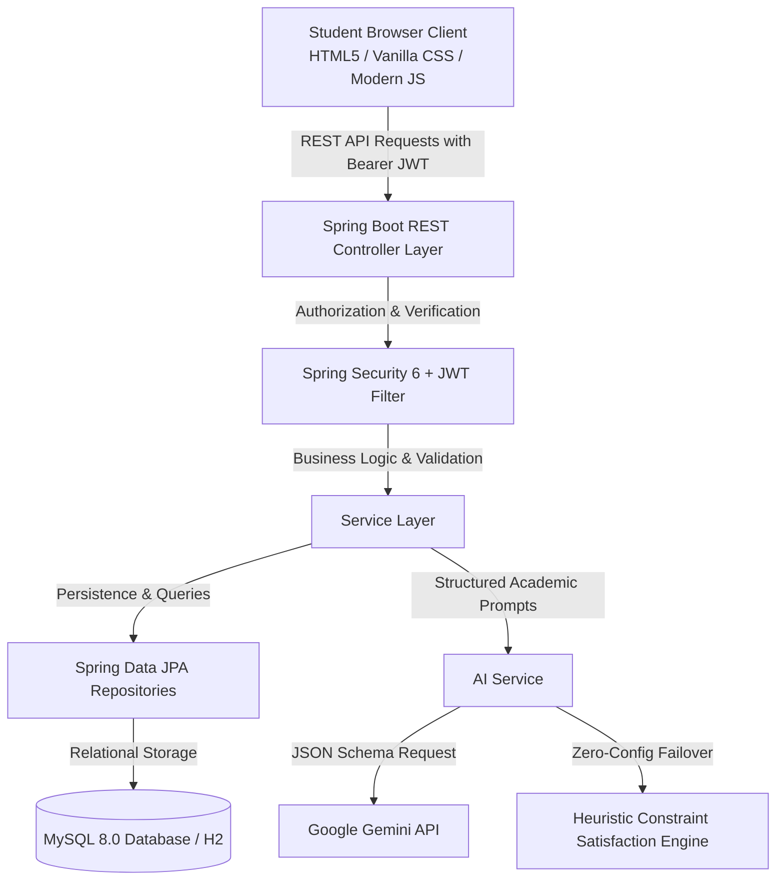

# AI Study Planner 🎓

[](https://adoptium.net/)
[](https://spring.io/projects/spring-boot)
[](https://spring.io/projects/spring-security)
[](https://www.mysql.com/)
[](https://aistudio.google.com/)

> **A production-style, full-stack academic study planning web application designed for university students to organize coursework, prepare for exams, track real syllabus progress, and generate personalized AI-driven study timetables.**

Built as a capstone portfolio project for a **B.Tech Computer Science & Engineering (Artificial Intelligence)** student, demonstrating clean architecture, RESTful API design, database normalization, stateless JWT security, and LLM prompt engineering with deterministic fallback systems.

---

## 📌 Architecture & Data Flow

The application follows an enterprise multi-tier architecture with clean separation of responsibilities:



---

## ✨ Key Features

### 1. Student Authentication & Strict Data Isolation
- **Secure Registration & Login**: Validated inputs, email uniqueness checks, and industry-standard **BCrypt password hashing**.
- **Stateless JWT Tokens**: 24-hour expiration token mechanism passed in `Authorization: Bearer <token>` headers.
- **Resource Ownership Enforcement**: Every query strictly validates student identity (`userId`). Changing IDs in URLs or API requests returns `403 Forbidden` or `404 Not Found`.
- **Pre-seeded Demo Mode**: Quick access via `demo@example.com` (`Demo@12345`) or full new student registration.

### 2. Subject & Topic Syllabus Management
- Organize curriculum with custom **Difficulty levels** (`EASY`, `MEDIUM`, `HARD`) and **Priority weights** (`LOW`, `MEDIUM`, `HIGH`).
- Granular topic management with estimated study durations in minutes and dynamic status switches (`NOT_STARTED`, `IN_PROGRESS`, `COMPLETED`).

### 3. Exam Deadline Countdown Tracking
- Real-time countdown calculation (e.g. `🚨 5 Days Remaining`, `⚠️ 12 Days Remaining`).
- Urgent exams automatically prioritize topics in upcoming study sessions.
- Detailed focus topic checklists and exam-day logistics notes.

### 4. AI-Driven Study Plan Generator
- Synthesizes user preferences (available daily hours, preferred start time, plan duration, goals) against syllabus difficulty and exam proximity.
- Generates realistic, non-exhaustive timetables with **mandatory 15-minute rest breaks** to prevent student fatigue.
- Provides pedagogical AI reasoning for every task (e.g. *"High exam priority: Data Structures exam in 10 days; focus on BST validation algorithms"*).

### 5. Smart Missed-Task Redistribution
- Avoids the naive mistake of dumping all missed tasks onto the following day.
- Intelligently analyzes future schedule capacity and redistributes missed workloads across open study windows.

### 6. Interactive AI Study Assistant
- Student-friendly academic coach capable of breaking down complex computer science concepts (e.g., *Linked Lists*, *Tree Traversals*, *ACID Transactions*, *OOP Principles*).
- Formatted markdown explanations, code snippets, and evidence-based study tips (*Active Recall*, *Feynman Technique*, *Pomodoro*).

### 7. Analytical Progress Tracking
- Subject-wise progress bars and topic completion percentages.
- Cumulative metrics: topics remaining, sessions completed vs missed, and total logged productive study hours.

### 8. Historical Plan Archives & Profile Management
- Archive of past study schedules with active badge indicators.
- Profile settings allowing students to customize default daily hours and preferred study start times.

---

## 🛠️ Technology Stack

| Layer | Technology | Purpose |
|---|---|---|
| **Backend** | Java 17, Spring Boot 3.2.3 | Core backend framework and REST API |
| **Security** | Spring Security 6, JJWT 0.12.5 | Stateless JWT authentication, BCrypt hashing |
| **Data & ORM** | Spring Data JPA, Hibernate, MySQL, H2 | Relational schema, cascade rules, indexing |
| **AI Integration**| Google Gemini API (`gemini-1.5-flash`) | LLM study planning & conversational tutor |
| **Frontend** | HTML5, Vanilla CSS3, Modern JavaScript | Responsive academic UI, zero external bloat |
| **Build Tool** | Apache Maven 3.9+ | Dependency resolution and automated packaging |

---

## 🚀 Quick Setup & Startup Guide

### Prerequisites
- **Java Development Kit (JDK) 17 or higher** *(Critical: Ensure JDK 17 is used. If an older Java 8 is in your PATH, use `start-backend.bat` which automatically targets JDK 17).*
- *(Optional)* **MySQL 8.0+** *(The project runs out of the box with zero setup using embedded H2 in MySQL mode. If you prefer MySQL, follow the MySQL setup below).*

---

### Method 1: Instant 1-Click Startup (Recommended on Windows)

1. **Start the Backend**:
   - Double-click **`start-backend.bat`** (or run `.\start-backend.bat` in PowerShell/CMD).
   - This script automatically detects JDK 17, builds the JAR if needed, and starts Spring Boot on `http://localhost:8080`.

2. **Start the Frontend**:
   - Double-click **`start-frontend.bat`** (or run `.\start-frontend.bat`).
   - This opens your default browser directly to `http://localhost:8080/index.html`.

---

### Method 2: Manual Terminal Startup

1. **Verify Java 17**:
   ```bash
   java -version
   ```
   *If your default `java` is Java 8, point to JDK 17:*
   ```powershell
   $env:JAVA_HOME = "C:\Program Files\Eclipse Adoptium\jdk-17.0.19.10-hotspot"
   $env:Path = "$env:JAVA_HOME\bin;" + $env:Path
   ```

2. **Build and Run Backend**:
   ```bash
   cd backend
   mvn clean package -DskipTests
   java -jar target/ai-study-planner-backend-1.0.0.jar
   ```
   *The backend starts at `http://localhost:8080` with embedded H2 (MySQL mode).*

3. **Open Frontend**:
   Navigate in your browser to:
   ```
   http://localhost:8080/
   ```
   *(Spring Boot serves the frontend directly, or you can open `frontend/index.html` via any web server).*

---

### 🗄️ Optional: Connecting to MySQL

By default, the application runs zero-configuration using embedded H2 in MySQL compatibility mode. To use a local MySQL server:

1. **Create the Database in MySQL**:
   ```sql
   CREATE DATABASE IF NOT EXISTS study_planner CHARACTER SET utf8mb4 COLLATE utf8mb4_unicode_ci;
   ```
   *(Optional: run `database/schema.sql` if you want predefined tables, or let Hibernate auto-generate them).*

2. **Configure Connection**:
   See `backend/application.properties.example`. Either pass environment variables:
   ```powershell
   $env:DB_URL="jdbc:mysql://localhost:3306/study_planner?useSSL=false&serverTimezone=UTC&allowPublicKeyRetrieval=true"
   $env:DB_DRIVER="com.mysql.cj.jdbc.Driver"
   $env:DB_USERNAME="root"
   $env:DB_PASSWORD="your_mysql_password"
   ```
   Or set them directly in `backend/src/main/resources/application.properties`.

3. **Launch the backend** — Hibernate will automatically validate or update the schema in your MySQL database.

---

### 🔑 Demo Credentials & First Run
- **Demo Account**: Click **"Auto-fill Demo Account"** on the login page (`demo@example.com` / `Demo@12345`).
- **Create Account**: Go to `register.html` to register a new student account. If you re-register with an existing email, the system clearly alerts: *"This email is already registered."*

---

## 📡 REST API Reference

### Authentication (`/api/auth`)
- `POST /api/auth/register` — Register a new student account.
- `POST /api/auth/login` — Authenticate and receive JWT token.
- `GET /api/auth/me` — Get current authenticated student details.

### Subjects (`/api/subjects`)
- `GET /api/subjects` — List all subjects for logged-in student.
- `POST /api/subjects` — Create a new subject with difficulty and priority.
- `GET /api/subjects/{id}` — Get single subject details.
- `PUT /api/subjects/{id}` — Update subject parameters.
- `DELETE /api/subjects/{id}` — Delete subject and associated topics/tasks.

### Topics (`/api/subjects/{subjectId}/topics` & `/api/topics`)
- `GET /api/subjects/{subjectId}/topics` — List topics for a specific subject.
- `POST /api/subjects/{subjectId}/topics` — Add topic to subject.
- `PUT /api/topics/{id}` — Update topic details.
- `PATCH /api/topics/{id}/status` — Update topic completion status.
- `DELETE /api/topics/{id}` — Delete topic.

### Exams (`/api/exams`)
- `GET /api/exams` — List exams with days-remaining countdowns.
- `POST /api/exams` — Schedule an exam with important topics and notes.
- `PUT /api/exams/{id}` — Update exam schedule.
- `DELETE /api/exams/{id}` — Remove exam.

### Study Plans & Tasks (`/api/study-plans` & `/api/tasks`)
- `POST /api/study-plans/generate` — Generate AI study plan based on availability.
- `GET /api/study-plans/active` — Retrieve current active study timetable.
- `GET /api/study-plans` — Retrieve study plan archive history.
- `POST /api/study-plans/{id}/adjust` — Smart adjustment & redistribution of missed tasks.
- `GET /api/tasks` — List tasks with optional date & status filters.
- `PUT /api/tasks/{id}/complete` — Mark task completed.
- `PUT /api/tasks/{id}/missed` — Mark task missed.

### AI Assistant (`/api/ai`)
- `POST /api/ai/chat` — Conversational study assistance, explanations, and advice.

### Progress & Profile (`/api/progress` & `/api/user`)
- `GET /api/progress` — Aggregated completion %, topic stats, and study hours.
- `GET /api/user/profile` — Fetch student settings.
- `PUT /api/user/profile` — Update name, daily hours, and preferred start time.

---

## 🗄️ Database Schema (`database/schema.sql`)

```sql
users (id, full_name, email, password_hash, daily_study_hours, preferred_study_time, created_at, updated_at)
subjects (id, user_id, name, description, difficulty, priority, exam_date, created_at, updated_at)
topics (id, subject_id, name, description, difficulty, estimated_minutes, status, created_at, updated_at)
exams (id, user_id, subject_id, exam_date, exam_time, important_topics, notes, created_at)
study_plans (id, user_id, title, generated_at, start_date, end_date, available_hours_per_day, preferred_start_time, status, prompt_summary)
study_tasks (id, study_plan_id, subject_id, topic_id, task_date, start_time, duration_minutes, priority, reason_recommendation, status, completed_at)
```

---

## 🔮 Future Roadmap
- [ ] Push notifications & daily morning study briefing via email/SMS.
- [ ] Google Calendar & Apple iCalendar two-way synchronization.
- [ ] Interactive in-browser Pomodoro timer widget with ambient focus sounds.
- [ ] AI-generated flashcard quizzes based on custom syllabus topics.
- [ ] Native Android/iOS client using React Native / Flutter.

---

## 📜 License
This project is open source and available under the [MIT License](LICENSE).
